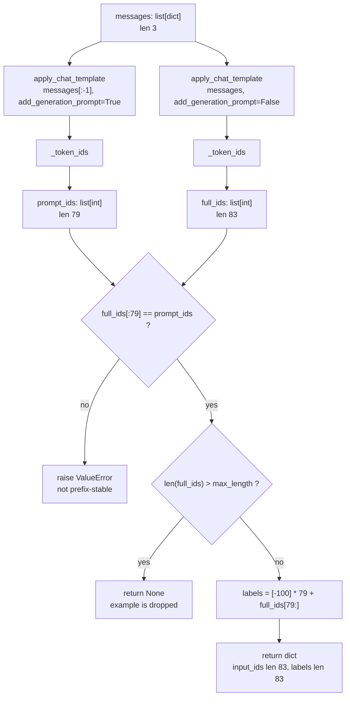

# tokenization.py — explainer
> src/tokenization.py @ 205b166 · 132 lines · generated 2026-08-18

**How to read the evidence in this document.** Every substantive claim below
carries one of three markers, because a learner has no independent basis for
telling a confident guess from a fact:

- **Observed** — printed by code that was actually run. The probe and its output
  are described at the top of §3.
- **Cited** — quoted from a docstring, a spec, a plan, a commit message, or a
  test in this repository. The source is named.
- **Inference** — my reading of the code. Reasonable, but nobody wrote it down
  and I did not run anything that proves it.

Anything I could neither observe nor cite nor reasonably infer has been cut
rather than smoothed over.

## 0. Orientation

A language model is trained by showing it text and asking it to predict the next
word, scoring it on how well it did. But when you are teaching a model to
*answer questions*, you do not want it graded on its ability to reproduce the
question — you want it graded only on the answer. This file is the piece of
machinery that draws that line. It takes a conversation (a system instruction, a
user's message, and the assistant's reply), converts it into the integers a model
actually consumes, and marks every position belonging to the question with a
special number, `-100`, that the scoring function has been built to skip.

**Called by** — found with `grep -rn --exclude-dir={.venv,node_modules,.git,dist,build,__pycache__} "tokenization" .`, not assumed:

- `tests/test_tokenization.py` — the only code in the repository that imports
  this module today (**Observed**: the grep returned no other importer; `src/`
  contains only `__init__.py`, `prompts.py`, and `tokenization.py`).
- **Cited**, `docs/superpowers/plans/2026-08-17-healthcare-lora-sft.md`: three
  further callers are planned but **not yet written** — `data_prep.py` and
  `train.py` are to call `build_training_example`, `train.py` is to call
  `PadCollator`, and `evaluate.py` is to call `render_prompt`. None of those
  files exist in the tree at the hash above. This matters for reading the file:
  its shape is designed around callers that do not exist yet, which is why some
  functions look unused.

**Calls out to:**

- `torch` — only to turn Python lists of integers into tensors, at the very last
  step. Everything before that is plain Python.
- `collections.abc.Mapping` — a standard-library type used for one `isinstance`
  test. It carries no behaviour here; it is used purely as a question: "is this
  thing dictionary-like?"

**In one sentence:** it turns a chat conversation into `input_ids` and `labels`
lists where the labels for the prompt are replaced by `-100`, so that training
computes loss on the assistant's answer only, and then pads a batch of those
into tensors.

## 1. Inventory

Everything the file defines. Every row is picked up again in a later section.

| Symbol | Kind | Signature | Purpose |
|---|---|---|---|
| `IGNORE_INDEX` | constant | `= -100` | The value PyTorch's cross-entropy loss skips. The whole file exists to put this number in the right places. |
| `_token_ids` | function | `_token_ids(encoded)` | Normalizes whatever `apply_chat_template` returned into a flat `list[int]`. Leading underscore marks it private to this module. |
| `render_prompt` | function | `render_prompt(messages, tokenizer) -> str` | Renders messages to a *string* ending in the assistant header. Inference-side only; nothing is tokenized. |
| `build_training_example` | function | `build_training_example(messages, tokenizer, max_length) -> dict \| None` | The core routine: tokenize, verify the prefix assumption, drop if too long, build masked `labels`. |
| `PadCollator` | class | `PadCollator(pad_token_id)` | Pads a list of examples to equal length and stacks them into tensors. |
| `PadCollator.__init__` | method | `__init__(self, pad_token_id)` | Stores the one number the collator needs. |
| `PadCollator.__call__` | method | `__call__(self, features) -> dict[str, torch.Tensor]` | Does the padding. Defined as `__call__` so an *instance* can be passed wherever a function is expected. |

| Package | What is used from it | Why |
|---|---|---|
| `torch` | `torch.tensor`, `torch.long` | To build the three batched tensors returned by the collator. This is the file's only dependency on the ML stack. |
| `collections.abc` | `Mapping` | To ask "is this dictionary-*like*?" rather than "is this exactly a `dict`?". §2 and §5 show why the distinction decides whether the file works. |

## 2. How the code is written

Pass 1: a walk down the file through a **language** lens. Each construct is
named the first time it appears and then assumed understood.

### The module docstring (lines 1-24)

A string literal as the very first statement in a file is a **module
docstring**. It is not a comment — Python stores it on the module object as
`__doc__`, which is what `help(tokenization)` prints. The triple quotes `"""`
let it span lines.

This one is unusually long and is doing teaching rather than API description: it
explains what supervised fine-tuning is before explaining what the code does.

### `from collections.abc import Mapping` and `import torch` (lines 26-28)

Two different import forms. `import torch` binds the whole module to the name
`torch`, so its contents are reached through a dot: `torch.tensor`. `from
collections.abc import Mapping` reaches into a module and binds one name
directly, so `Mapping` is used bare.

### `IGNORE_INDEX = -100` (line 30)

A **module-level constant**. Python has no `const` keyword — nothing prevents
another module from reassigning `tokenization.IGNORE_INDEX`. The
`UPPER_SNAKE_CASE` name is a convention meaning "do not reassign this", enforced
by other programmers rather than by the language.

### `def _token_ids(encoded):` (line 33)

`def` **defines** a function; it does not run it. The body executes only when
something calls `_token_ids(...)` later.

The **leading underscore** on the name is another convention with no enforcement
behind it: it marks the function as internal to this module. `from tokenization
import *` would skip it, and a reader should take it as "not part of the public
API".

`encoded` is a **parameter** — a name that exists only inside the function. The
value passed in at a call site is the **argument**. There is no type annotation:
this file uses none, and Python would not enforce them at runtime if it did.

#### `isinstance(encoded, Mapping)` (line 49)

`isinstance(x, T)` asks whether `x` is an instance of type `T`, *including
subclasses*. The interesting choice here is `Mapping` — an **abstract base
class** from `collections.abc` — rather than the concrete `dict`.

```python
if isinstance(encoded, Mapping):  # BatchEncoding is a UserDict, not a dict
    encoded = encoded["input_ids"]
```

`Mapping` describes a *capability*: anything supporting `[]` lookup, `len`,
iteration over keys, and so on. `dict` is one specific class that has that
capability. A class can be a `Mapping` without being a `dict` — which is exactly
the case here, and §5 exercise 1 shows what happens when you get it wrong.

Note also `encoded = encoded["input_ids"]`: rebinding the parameter name to a
new value. This is legal and common; it does not affect the caller's variable,
because the name is local to the function.

#### `hasattr(encoded, "tolist")` (line 51)

**Duck typing** — the idea that what matters is what an object can *do*, not
what it is. `hasattr(x, "name")` asks whether the attribute exists.

```python
if hasattr(encoded, "tolist"):  # torch/np tensor
    encoded = encoded.tolist()
```

Rather than importing numpy and torch and testing against both their tensor
types, the code asks the only question it cares about: can you convert yourself
to a list? Anything that can, does.

#### `if encoded and isinstance(encoded[0], list)` (line 53)

**Truthiness.** Python objects can be used directly in a boolean test. An empty
list, an empty string, `0`, and `None` are all **falsy**; a non-empty list is
**truthy**. So `if encoded and ...` means "if the list is non-empty, and ...".

The order matters and is not stylistic. Python's `and` **short-circuits**: if
the left side is falsy the right side never runs. That is what stops
`encoded[0]` from raising `IndexError` on an empty list.

#### `return list(encoded)` (line 55)

`list(x)` builds a **new** list from any iterable. Calling it on something that
is already a list produces a copy — so the caller cannot mutate the tokenizer's
internal state through the returned object.

This is also the exact call that makes the `Mapping`/`dict` distinction lethal:
`list()` on a mapping yields its **keys**, not its values, and does so without
complaint.

### `def render_prompt(messages, tokenizer):` (line 58)

Nothing new syntactically. Note the `return` of a single expression, and the
**keyword arguments** in the call:

```python
return tokenizer.apply_chat_template(
    messages, tokenize=False, add_generation_prompt=True
)
```

`messages` is passed **positionally** (matched by position), while
`tokenize=False` and `add_generation_prompt=True` are passed **by keyword**
(matched by name). Keyword arguments can be given in any order, and at a call
site like this one they double as documentation of what the value means.

The docstring contains `<|im_start|>assistant\\n` with a doubled backslash. Inside
a normal (non-raw) string, `\n` would become an actual newline; `\\n` keeps the
two literal characters so the docstring displays the escape rather than
performing it.

### `def build_training_example(messages, tokenizer, max_length):` (line 69)

Three parameters, no defaults — every caller must supply all three.

#### `messages[:-1]` (line 80)

**Slicing.** `a[start:stop]` produces a new list from `start` up to but not
including `stop`. Omitting either end means "from the beginning" / "to the end".
A **negative index** counts from the right, so `-1` is the last element.

`messages[:-1]` therefore means *everything except the last message* — here,
system and user, dropping the assistant's answer. It never raises on a short
list: slicing clamps rather than erroring.

#### `full_ids[: len(prompt_ids)] != prompt_ids` (line 93)

Two things at once. `full_ids[: len(prompt_ids)]` is a slice taking the first
*N* elements. `!=` on two lists compares them **element by element** — it is not
an identity check, so two distinct list objects holding equal integers compare
equal.

The related distinction: `is` asks whether two names refer to the very same
object, `==` asks whether they hold equal values. This line wants values, so it
uses `!=`.

#### `raise ValueError(...)` (lines 94-96)

`raise` throws an exception, stopping the function immediately and propagating
up until something catches it. `ValueError` is the standard built-in for "the
argument's type is fine but its value is not". Nothing in this file catches it;
it is meant to reach the developer.

#### `return None` (line 99)

An **early return** — leaving the function before the end. `None` is Python's
"no value" object, used here as a **sentinel**: a value whose meaning is "there
is no result", distinct from an empty or zero result.

This matters at the call site. Because `None` is falsy and so is an empty dict,
a caller writing `if result:` cannot distinguish "dropped" from "empty"; a
caller writing `if result is not None:` can. **Cited**: the planned caller in
`docs/superpowers/plans/2026-08-17-healthcare-lora-sft.md` uses
`if build_training_example(...) is None:`, the safe form.

A function that falls off the end without a `return` returns `None` too — so the
explicit `return None` here is a signal to the reader that dropping is a real,
intended outcome rather than an oversight.

#### `labels = [IGNORE_INDEX] * len(prompt_ids) + full_ids[len(prompt_ids):]` (line 101)

Three list operations composed:

- `[IGNORE_INDEX] * n` — **list repetition**, producing a new list of `n` copies.
  (Safe here because integers are immutable. The same trick with a mutable
  element, `[[]] * 3`, would give three references to *one* list — a classic
  Python trap, not triggered by this line.)
- `full_ids[len(prompt_ids):]` — a slice from *N* to the end: the answer tokens.
- `+` — **list concatenation**, producing a third new list.

Nothing is mutated; the result is built fresh.

#### `return {"input_ids": full_ids, "labels": labels}` (line 102)

A **dict literal**: key-value pairs in braces. Python dicts preserve insertion
order (guaranteed since 3.7). Returning a dict rather than a tuple means the
caller reads `example["labels"]` instead of `example[1]`, which cannot be
silently swapped.

### `class PadCollator:` (line 105)

`class` defines a **template**; the thing you get from `PadCollator(...)` is an
**instance**. The class is not the object, in the same way a blueprint is not a
building.

#### `def __init__(self, pad_token_id):` (line 115)

**Dunder** (double-underscore) names are Python's hooks: methods the language
itself calls at defined moments. `__init__` runs immediately after a new
instance is created, to set it up.

It is an *initializer*, not a constructor in the C++ sense — the object already
exists by the time `__init__` runs, and `__init__` returns nothing.

`self` is the instance, passed automatically. Writing `PadCollator(151643)` calls
`__init__(the_new_instance, 151643)`. The name `self` is convention, not a
keyword; any name would work and every reader would hate you.

```python
self.pad_token_id = pad_token_id
```

This creates an **instance attribute** — data stored on this particular object,
distinct from a class attribute shared by all instances. Note the two
`pad_token_id`s are different things: `self.pad_token_id` is the attribute,
`pad_token_id` is the parameter.

#### `def __call__(self, features):` (line 118)

`__call__` is the dunder that makes an instance usable **as if it were a
function**. With it defined, `collator(batch)` is legal and means
`collator.__call__(batch)`.

So `PadCollator` produces objects that are callable like functions but that also
*remember* something — here `pad_token_id`. §4 covers why that is the right
shape for this job.

#### `max(len(f["input_ids"]) for f in features)` (line 119)

A **generator expression**: `expr for item in iterable`, written without square
brackets. It produces values lazily, one at a time, rather than building an
intermediate list. Passed as the sole argument to a function it needs no extra
parentheses of its own.

The list-comprehension form would be `[len(f[...]) for f in features]`; the
generator form avoids materialising a list that is consumed once.

#### `input_ids, attention_mask, labels = [], [], []` (line 121)

**Tuple unpacking.** The right-hand side builds a tuple of three new empty
lists; the left-hand side names them positionally. Three separate lists are
created — this is not the aliasing bug that `a = b = []` would produce.

#### The loop body (lines 122-126)

`for feature in features:` iterates directly over the sequence — no index
variable, because none is needed. (`enumerate` would supply one if it were.)

`.append(...)` mutates a list in place and returns `None`, which is why its
result is never assigned.

#### The returned dict (lines 128-132)

Nothing new: a dict literal whose values are calls to `torch.tensor(...)`.
`dtype=torch.long` is a keyword argument, covered in §3.

## 3. What the data looks like

Pass 2: the same walk through a **data** lens. The constructs are assumed known
from §2 and are not re-explained.

### How the values below were obtained

**Observed.** Every number, length, and shape in this section was printed by a
probe script run against this repository — not estimated, and not read off the
library source. Specifically:

- Interpreter: `.venv/bin/python`, Python 3.11.15, with `transformers` 5.15.0
  and `torch` 2.13.0 (**Observed**: printed by the probe).
- Tokenizer: `AutoTokenizer.from_pretrained("Qwen/Qwen2.5-1.5B-Instruct")`,
  resolved from the local HuggingFace cache with `HF_HUB_OFFLINE=1`, so no
  network access and no checkpoint download was involved. **Observed**: the
  loaded class is `Qwen2Tokenizer`; only tokenizer files are cached (~11 MB),
  not model weights.
- Example input: the same fixture the tests use — **Cited**,
  `tests/test_tokenization.py`, `build_classification_messages("itchy rash",
  ["allergy", "malaria", "psoriasis"], answer="psoriasis")`. Using the tests'
  own values means the numbers below are values the test suite already exercises.

The probe script lives outside the repository (in a scratchpad) and wrote
nothing into the project tree.

### `messages` — the input

Type `list[dict]`, length 3. Each element has exactly the keys `role` and
`content`, both `str`. **Observed** roles, in order: `system`, `user`,
`assistant`.

| Index | `role` | `content` (observed, abbreviated) |
|---|---|---|
| 0 | `system` | `"You are a clinical triage assistant. … Valid conditions:\n- allergy\n- malaria\n- psoriasis"` |
| 1 | `user` | `"[TASK: CLASSIFY]\nitchy rash"` |
| 2 | `assistant` | `"psoriasis"` |

The invariant that matters downstream: **the assistant turn is last**, which is
what makes the `messages[:-1]` slice (see §2) mean "the prompt".

### `render_prompt` — a string, not tokens

**Observed.** Returns `str`, length 394 characters for the fixture above (with
the assistant turn omitted, as at inference time):

```
<|im_start|>system
You are a clinical triage assistant. Given a patient's description of their symptoms, identify the single most likely condition.

Respond with only the condition name, exactly as written in the list below. Do not explain your reasoning.

Valid conditions:
- allergy
- malaria
- psoriasis<|im_end|>
<|im_start|>user
[TASK: CLASSIFY]
itchy rash<|im_end|>
<|im_start|>assistant
```

Note the trailing `<|im_start|>assistant\n` with nothing after it — that is
`add_generation_prompt=True` at work, and it is what the test
`test_render_prompt_ends_with_assistant_header` pins down (**Cited**,
`tests/test_tokenization.py`).

### What `apply_chat_template(tokenize=True)` actually returns

This is the fact the whole `_token_ids` function exists to absorb.

**Observed**, on transformers 5.15.0:

| Property | Observed value |
|---|---|
| Return type | `BatchEncoding` |
| Its `__mro__` | `BatchEncoding → UserDict → MutableMapping → Mapping → Collection → Sized → Iterable → Container → Generic → object` |
| `len(returned)` | `2` |
| `list(returned)` | `['input_ids', 'attention_mask']` |
| `returned["input_ids"]` | `list` of `int`, length 79 |

Two things are worth staring at. First, `dict` does **not** appear anywhere in
that MRO — `BatchEncoding` inherits from `UserDict`, which is a `Mapping` but not
a `dict` subclass. Second, `len()` on it is `2` and iterating it yields the two
key *strings*. Both of those are perfectly well-defined behaviours that happen to
be catastrophic if you expected a list of tokens.

### `prompt_ids` and `full_ids`

Both `list[int]` after `_token_ids` normalization (see §2).

| Variable | Type | Length (observed) | First / last elements (observed) |
|---|---|---|---|
| `prompt_ids` | `list[int]` | 79 | `[151644, 8948, 198, 2610, 525, …]` / `[…, 151645, 198, 151644, 77091, 198]` |
| `full_ids` | `list[int]` | 83 | same first 79 elements, then `[1690, 91903, 151645, 198]` |

**Observed**: `full_ids[:79] == prompt_ids` is `True` — the prefix assumption
holds for this template and this input, which is the condition the code checks
rather than assumes.

**Observed** decodings, which make the numbers legible:

- `prompt_ids[-8:]` decodes to `'itchy rash<|im_end|>\n<|im_start|>assistant\n'`
- `full_ids[79:]` decodes to `'psoriasis<|im_end|>\n'`

So the four unmasked tokens are the answer word plus the end-of-turn marker and
a newline. **Inference**: `psoriasis` costs two tokens (`1690, 91903`) because
it is not a common enough word to have its own single vocabulary entry — I did
not verify the vocabulary directly, only that two tokens decode to it together.

### `labels` — the point of the file

**Observed** for the fixture: `list[int]`, length 83 — identical to
`len(input_ids)`, which is what `test_input_ids_and_labels_have_equal_length`
asserts (**Cited**). Exactly 79 entries equal `-100`, and they are the first 79,
contiguous.

```
index:      0      1      2    ...    76     77     78  |   79     80     81    82
input_ids: [151644, 8948,  198, ..., 151644, 77091, 198 | 1690, 91903, 151645, 198]
            └──────────── prompt: 79 tokens ──────────┘ └──── answer: 4 tokens ───┘

labels:    [ -100,  -100, -100, ...,  -100,  -100, -100 | 1690, 91903, 151645, 198]
            └────── skipped by cross-entropy ─────────┘ └──── graded, loss here ──┘
```

The two rows are the same length and the same tokens; the only difference is
that the left band of `labels` has been overwritten with `-100`. The model still
*sees* the prompt — it is untouched in `input_ids`, so attention reads it — it is
simply not scored on predicting it.

**Observed**: `[t for t in labels if t != -100]` decodes to `'psoriasis<|im_end|>\n'`,
which is `test_unmasked_labels_decode_to_the_answer` (**Cited**).

### Data flow

The path branches twice, so a diagram earns its place here:



### `PadCollator.__call__` output

Input: a `list` of the dicts produced above. **Observed** with the test's own
two-example fixture (**Cited**, `tests/test_tokenization.py`) —
`[{"input_ids": [1,2,3], "labels": [-100,2,3]}, {"input_ids": [4,5], "labels": [-100,5]}]`
and `pad_token_id=151643`:

| Key | Type | Shape | dtype | Observed value |
|---|---|---|---|---|
| `input_ids` | `torch.Tensor` | `(2, 3)` | `torch.int64` | `[[1, 2, 3], [4, 5, 151643]]` |
| `attention_mask` | `torch.Tensor` | `(2, 3)` | `torch.int64` | `[[1, 1, 1], [1, 1, 0]]` |
| `labels` | `torch.Tensor` | `(2, 3)` | `torch.int64` | `[[-100, 2, 3], [-100, 5, -100]]` |

Three tensors, one shape, three *different* pad values — and that is the whole
design of the class:

```
                  ← max_len = 3 →
row 1 (len 2)   input_ids  [  4     5   151643 ]   pad = pad_token_id (151643)
                attention  [  1     1      0   ]   pad = 0
                labels     [-100    5   -100   ]   pad = IGNORE_INDEX (-100)
                                          ↑
                              three different fill values
                              for the same padded position
```

**Observed**: `torch.long` and `torch.int64` are the same dtype — the tensors
report `torch.int64` though the code asks for `torch.long`. `torch.long` is an
alias, not a distinct type.

**Observed**: `pad_token_id` for this tokenizer is `151643`, which decodes to
`'<|endoftext|>'`; `eos_token_id` is a *different* id, `151645`, which is
`<|im_end|>`.

### Borrowed-API ledger

"Theirs" means parameter names defined by the library; "ours" means the values
and data this repository supplies for them.

| Call | Package | Returns | Params (theirs) | Params (ours) | Version risk |
|---|---|---|---|---|---|
| `tokenizer.apply_chat_template(...)` | transformers 5.15.0 | `str` when `tokenize=False` (**Observed**: 394 chars); `BatchEncoding` when `tokenize=True` (**Observed**: keys `['input_ids', 'attention_mask']`) | `conversation`, `tokenize`, `add_generation_prompt`, plus `return_dict` which we never pass — **Observed**: its default is `True` in 5.15.0 | the `messages` list (or `messages[:-1]`); `tokenize=True/False`; `add_generation_prompt=True/False` | **High.** **Cited**, the `_token_ids` docstring: 4.x returned a plain `list[int]`, 5.x returns a `BatchEncoding`. **Inference**: the mechanism is the `return_dict` default flipping to `True`; I observed the 5.15.0 default but did not run a 4.x install to confirm the old one. |
| `torch.tensor(data, dtype=...)` | torch 2.13.0 | `torch.Tensor` (**Observed**: shape `(2, 3)`, dtype `torch.int64`) | `data`, `dtype` | the nested `list[list[int]]`; `dtype=torch.long` | Low. **Inference**: this signature is long-standing and stable; I did not survey torch's history. |
| `tokenizer.pad_token_id` | transformers 5.15.0 | `int` (**Observed**: `151643`) | — | — | Low. **Inference**: an attribute this basic is unlikely to move, but its *value* is model-specific and some tokenizers leave it `None`, which would poison the padding silently. Not observed here — this tokenizer sets it. |
| `isinstance(x, Mapping)` | stdlib `collections.abc` | `bool` | — | — | Low. **Inference**: `collections.abc` has been stable since Python 3.3. |

## 4. Why it is built this way

Pass 3: the same walk through a **design** lens. Recorded rationale is cited;
where none exists and I am reading the code, it is marked as inference.

### The concepts actually in play

- **Completion-only loss masking.** **Cited**, the module docstring: "Supervised
  fine-tuning is ordinary next-token prediction on (prompt, answer) pairs. The
  only thing that makes it 'supervised fine-tuning' … is WHERE the loss is
  computed: on the answer tokens only." Anchored at
  `build_training_example` — `labels = [IGNORE_INDEX] * len(prompt_ids) + full_ids[len(prompt_ids):]`.
- **The sentinel `-100`.** **Cited**, the inline comment on
  `IGNORE_INDEX = -100  # the value torch's cross-entropy skips`. The number is
  not arbitrary and not ours: it is PyTorch's default `ignore_index`.
  **Inference**: a negative value is chosen precisely because it can never
  collide with a real token id, which are non-negative.
- **See-but-do-not-grade.** **Cited**, module docstring: "The model still SEES
  those tokens (they stay in input_ids, so attention can use them); it just is
  not graded on predicting them." This is why the masking touches `labels` and
  never `input_ids` — anchored at `return {"input_ids": full_ids, "labels": labels}`,
  where `full_ids` goes out unmodified.
- **Prefix stability as a checked assumption.** Anchored at
  `if full_ids[: len(prompt_ids)] != prompt_ids:` with its comment "we check
  instead of hope".
- **Three pad values, one shape.** Anchored at `PadCollator.__call__` —
  `labels.append(feature["labels"] + [IGNORE_INDEX] * pad_len)` alongside
  `input_ids.append(feature["input_ids"] + [self.pad_token_id] * pad_len)`.

### Decisions, and what was rejected

**Doing it by hand instead of using TRL.** **Cited**, module docstring:
"Libraries such as TRL automate this. We do it by hand because it is thirty
lines, because it removes a fast-moving dependency, and because it is worth being
able to explain." The plan agrees — **Cited**,
`docs/superpowers/plans/2026-08-17-healthcare-lora-sft.md`: "This is the part
most tutorials hide inside a library call; here it is 30 explicit lines." The
spec's risk table names "TRL/PEFT API churn" as a risk to be mitigated by
pinning, which **Inference** suggests the dependency-churn argument was the
operative one rather than the pedagogical one.

**Dropping over-long examples rather than truncating them.** **Cited**, the
`build_training_example` docstring: "We drop rather than truncate: truncating a
dialogue while keeping its summary would train the model to invent details it
was never shown." **Cited** again in
`docs/superpowers/specs/2026-08-17-healthcare-lora-sft-design.md`: examples that
exceed the budget "are dropped rather than silently truncated — truncation would
produce targets that reference content the model cannot see, teaching it to
hallucinate. The number of dropped examples is recorded and reported." Note the
rationale is about *data quality*, not about avoiding a crash. Anchored at
`if len(full_ids) > max_length: return None`.

**Returning `None` rather than raising for the over-long case.** No recorded
rationale. **Inference**: dropping is an expected, routine outcome across a
dataset — the spec says the count is reported — so it is a value, not an error.
Contrast the prefix failure a few lines above, which *does* raise: that one
should never happen, and if it does, nothing downstream can sensibly continue.
The file uses the two mechanisms to mean two different things.

**Checking the prefix rather than trusting it.** **Cited**, the inline comment:
"Our masking assumes prompt_ids is a literal prefix of full_ids. That holds for
ChatML-style templates because the special tokens are atomic, but a silent
violation would misalign every label, so we check instead of hope." **Cited**,
the test module docstring: "If a tokenizer ever violated that, labels would
silently misalign by a token or two and training would quietly degrade."
**Inference**: the cost asymmetry is what justifies it — the check is one list
comparison per example, while the failure it catches is invisible and would only
show up as a model that trains slightly worse for no discoverable reason.

**`Mapping` rather than `dict`.** This one has the strongest paper trail of
anything in the file. **Cited**, the commit message on `08810c1`: "Fixes
`_token_ids` to check `collections.abc.Mapping` rather than `dict`: BatchEncoding
subclasses UserDict, so an `isinstance(x, dict)` check misses and `list(x)`
yields the mapping's keys." **Cited**, the `_token_ids` docstring, which spells
out the same trap. §5 exercise 1 reproduces it.

**`__call__` on a class rather than a plain function.** No recorded rationale.
**Inference**, from the code: padding needs `pad_token_id`, which is a property
of the tokenizer and not of the batch. A plain function would have to take it as
a second parameter — but the consumer, a HuggingFace `Trainer`, calls its
collator with exactly one argument, the list of features. `__call__` lets the
instance capture `pad_token_id` at construction and still satisfy the
one-argument calling convention. **Cited** support that this is the real
constraint: the planned trainer wiring in the plan is
`data_collator=PadCollator(tokenizer.pad_token_id)` — constructed with the id,
then called by the framework with only the batch. A closure would solve the same
problem; **Inference**, a class is preferred because it is inspectable and
picklable, which matters for multiprocess data loading.

### Where the bugs hide

**What this code defends against:**

- The transformers 4.x/5.x return-type change, absorbed in exactly one place
  (`_token_ids`). **Cited**, its docstring: "we normalize once, here, and let
  every caller assume a flat list."
- The `UserDict`-is-not-a-`dict` trap, via the `Mapping` check.
- Tensor and numpy returns, via the `hasattr(encoded, "tolist")` branch.
- A batch-of-one nesting, via `if encoded and isinstance(encoded[0], list)`.
- Template drift breaking the prefix assumption, via the explicit check.
- Confusing the two pad values, via `PadCollator` doing all three at once so a
  caller cannot get them out of step.

**What it does not defend against** (**Inference** throughout — these are gaps I
found by looking, not documented limitations):

- `pad_token_id=None`. Some tokenizers do not define one. `[None] * pad_len`
  would build fine and `torch.tensor` would then raise a type error some distance
  from the cause. `PadCollator.__init__` does not validate its argument.
- An empty `features` list. `max(...)` on an empty generator raises
  `ValueError: max() arg is an empty sequence` — an unhelpful message, though at
  least a loud one.
- Messages whose last element is *not* the assistant turn. `messages[:-1]` would
  silently slice off the wrong thing; nothing checks roles.
- `max_length` is compared against `len(full_ids)` only. **Observed** in §5
  exercise 4, the comparison is `>`, so `max_length` is inclusive — an example of
  exactly `max_length` tokens is kept.
- A prompt that is longer than `max_length` while the *full* sequence is not is
  impossible, since `prompt_ids` is a prefix — so that case needs no guard.

### How the tests pin it down

**Cited**, `tests/test_tokenization.py`. The suite is unusually well aimed: each
test targets a failure mode that would otherwise be silent.

| Test | What would slip through without it |
|---|---|
| `test_masked_prefix_is_the_whole_prompt_not_a_token_or_two` | The `len(BatchEncoding) == 2` bug. Its `assert n_masked > 20` is a deliberate regression guard — the comment says so explicitly. |
| `test_input_ids_and_labels_have_equal_length` | An off-by-one in the label construction, which torch would report far away. |
| `test_prompt_tokens_are_masked_and_answer_tokens_are_not` | Masking everything, or nothing. |
| `test_unmasked_labels_decode_to_the_answer` | Masking the wrong *region* — the strongest of the four, since it checks meaning rather than counts. |
| `test_overlong_example_returns_none` | Silent truncation creeping back in. |
| `test_render_prompt_ends_with_assistant_header` | A dropped `add_generation_prompt`, which would make the model continue the user's turn instead of answering. |
| `test_collator_pads_inputs_with_pad_id_and_labels_with_ignore_index` | The classic pad-value confusion; it asserts all three tensors separately. |

**Inference**: what the suite does *not* cover is the prefix-check `raise` — no
test constructs a template that violates prefix stability, so the error path is
untested. §5 exercise 5 exercises it by hand.

## 5. Break it

Change one thing, predict what happens, then look. Every answer below was
obtained by copying `src/tokenization.py` to a scratchpad, editing the copy, and
running it against the real tokenizer — none is predicted.

1. In `_token_ids`, change `isinstance(encoded, Mapping)` to
   `isinstance(encoded, dict)`. Does it raise, or fail silently?
2. In `build_training_example`, change the prompt-side call from
   `add_generation_prompt=True` to `False`. Does the prefix check catch it?
3. In `PadCollator.__call__`, pad `labels` with `self.pad_token_id` instead of
   `IGNORE_INDEX`. What changes in the returned tensors, and what would the
   model learn?
4. The fixture tokenizes to 83 tokens. Call `build_training_example` with
   `max_length=83` and with `max_length=82`. Which one drops the example?
5. In `build_training_example`, change `messages[:-1]` to `messages` in the
   prompt-side call, leaving `add_generation_prompt=True`. What happens?

<details><summary>Answers</summary>

1. **Fails silently, and the silence is the whole problem.** No exception is
   raised anywhere in `_token_ids` or `build_training_example`. `BatchEncoding`
   is not a `dict`, so the check misses, `hasattr(..., "tolist")` is false, and
   execution reaches `list(encoded)` — which yields the mapping's **keys**.
   Observed: `input_ids` becomes the two strings
   `['input_ids', 'attention_mask']`, `len` 2, and `labels` becomes
   `[-100, -100]`. Both masked, so the "training example" contains zero
   supervised tokens.

   The error surfaces only much later, and disguised: feeding those examples to
   `PadCollator` raises `ValueError: too many dimensions 'str'` from
   `torch.tensor` — an error that points at the collator, not at the real bug
   three functions upstream. Observed. And note that on transformers 4.x, where
   the return was already a `list[int]`, the same broken check would have caused
   no visible symptom at all.

2. **No — the check passes, and the masking is silently wrong.** Prefix
   stability still holds, because dropping the generation prompt makes
   `prompt_ids` *shorter* while leaving it a genuine prefix. Observed:
   `n_masked` falls from 79 to 76, `len(labels)` is still 83, and the supervised
   region grows to seven tokens decoding to
   `'<|im_start|>assistant\npsoriasis<|im_end|>\n'`.

   So the model is now graded on producing the `<|im_start|>assistant` header
   that the serving harness always supplies for it. This is precisely the class
   of bug the prefix check does *not* catch: the check verifies that the mask
   boundary is at a real token boundary, not that it is at the *right* one.

3. **The padded label positions become real training targets.** Observed:
   `labels` changes from `[[-100, 2, 3], [-100, 5, -100]]` to
   `[[-100, 2, 3], [-100, 5, 151643]]`. Shape, dtype, `input_ids` and
   `attention_mask` are all unchanged — nothing looks wrong.

   `151643` decodes to `'<|endoftext|>'` (observed), so the model is being taught
   to emit end-of-text padding after short answers, in proportion to how ragged
   the batch is. `test_collator_pads_inputs_with_pad_id_and_labels_with_ignore_index`
   catches this; without that test it would show up only as a model that trails
   off oddly.

4. **`max_length=82` drops it; `max_length=83` keeps it.** Observed:
   `max_length=84` and `max_length=83` both return a dict with 83 tokens,
   `max_length=82` returns `None`. The comparison is `len(full_ids) > max_length`,
   so the bound is **inclusive** — an example exactly at the limit survives.
   Worth knowing if you ever need to reason about the boundary; off-by-one here
   would quietly change how many examples your dataset has.

5. **Raises — this is the one change that trips the guard.** Observed:
   `ValueError: Chat template is not prefix-stable; loss masking would misalign.`

   With `messages` instead of `messages[:-1]`, the prompt-side call renders the
   assistant's answer *and then* appends a fresh assistant header, so
   `prompt_ids` is longer than `full_ids` and cannot be its prefix. Comparing
   exercises 2 and 5 is the useful lesson: the check fires on a structural
   violation, and stays silent on a boundary that is merely in the wrong place.

</details>

## 6. Glossary

- **Abstract base class (ABC)** — a class that defines a capability rather than
  an implementation, usable with `isinstance` to ask "does this behave like X?".
  `Mapping` is one.
- **`add_generation_prompt`** — an `apply_chat_template` argument that appends
  the assistant header, signalling to the model that it is now its turn.
- **`attention_mask`** — a tensor of 1s and 0s, the same shape as `input_ids`,
  marking which positions are real content (1) and which are padding (0) that
  attention must ignore.
- **`BatchEncoding`** — the transformers container returned by tokenization. A
  `UserDict` subclass, therefore a `Mapping` but **not** a `dict`.
- **ChatML** — the chat markup this template uses, with `<|im_start|>` and
  `<|im_end|>` delimiting each turn.
- **Collator** — the callable that assembles a list of individual examples into
  one padded batch of tensors.
- **Cross-entropy loss** — the scoring function for next-token prediction. Its
  `ignore_index` parameter, defaulting to `-100`, names a target value to skip.
- **Dunder** — a name with double underscores at both ends (`__init__`,
  `__call__`), which the Python language itself calls at defined moments.
- **Duck typing** — deciding what an object can do by testing for a capability
  (`hasattr`) rather than for a type.
- **`dtype`** — a tensor's element type. `torch.long` and `torch.int64` are the
  same thing.
- **Generator expression** — `expr for x in xs` without brackets; produces values
  lazily instead of building a list.
- **`IGNORE_INDEX` / `-100`** — the label value cross-entropy skips; the
  mechanism by which prompt tokens are excluded from the loss.
- **`input_ids`** — the token ids the model reads. Never masked here.
- **Instance attribute** — data stored on one object (`self.pad_token_id`), as
  opposed to shared on the class.
- **`labels`** — the token ids the model is *graded* on. A copy of `input_ids`
  with the prompt region overwritten by `-100`.
- **Loss masking** — replacing label positions with `IGNORE_INDEX` so they
  contribute nothing to the gradient.
- **`Mapping`** — the `collections.abc` protocol for dictionary-like objects.
- **MRO (method resolution order)** — the ordered list of classes Python searches
  for an attribute; what `isinstance` effectively consults.
- **`pad_token_id`** — the token id used to fill `input_ids` out to the batch's
  longest example. Here `151643`, decoding to `<|endoftext|>`.
- **Prefix stability** — the property that tokenizing the prompt alone yields
  exactly the first N tokens of the full conversation. The assumption all the
  masking rests on.
- **Sentinel** — a value chosen to mean "nothing here", distinct from a real
  value. `None` for a dropped example; `-100` for an ignored label.
- **SFT (supervised fine-tuning)** — next-token prediction on (prompt, answer)
  pairs with the loss restricted to the answer.
- **Short-circuit** — `and` skipping its right operand when the left is falsy.
- **Slicing** — `a[start:stop]`, producing a new sequence; negative indices count
  from the right.
- **Tokenizer** — the component mapping text to integer ids and back.
- **Truthiness** — an object's implicit boolean value; empty containers, `0`, and
  `None` are falsy.
- **`UserDict`** — a standard-library dictionary-like base class that is *not* a
  `dict` subclass. The root of the trap this file guards against.

## 7. My notes

_Yours. Preserved verbatim when this document is regenerated._
