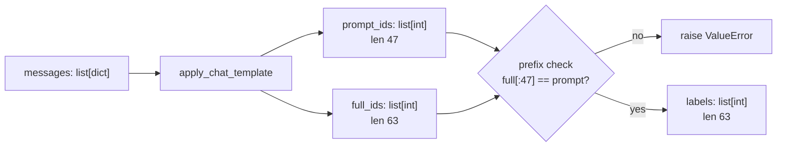
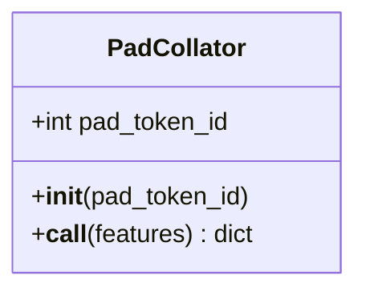

# explain-code Skill Implementation Plan

> **For agentic workers:** REQUIRED SUB-SKILL: Use superpowers:subagent-driven-development (recommended) or superpowers:executing-plans to implement this plan task-by-task. Steps use checkbox (`- [ ]`) syntax for tracking.

**Goal:** Build a personal-scope Claude Code skill, `/explain-code <path>`, that turns any source file into a persistent eight-section explainer document validated against the source.

**Architecture:** The skill is authored inside this repository at `skills/explain-code/` and symlinked to `~/.claude/skills/explain-code`, so it is version-controlled here but available in every project. `SKILL.md` holds the procedure and stays short; three `references/` files are read only when the procedure reaches them. A stdlib-only validator script makes the mechanical half of the quality bar executable — structure, section order, symbol coverage, anchoring, exercise shape — so those rules fail loudly instead of silently.

**Tech Stack:** Markdown (skill and references), Python 3.11 stdlib only for the validator (`ast`, `re`, `argparse`, `pathlib`), pytest for the validator's tests.

**Spec:** [docs/superpowers/specs/2026-08-18-explain-code-skill-design.md](../specs/2026-08-18-explain-code-skill-design.md)

## Global Constraints

- **Validator uses the standard library only.** It runs inside arbitrary projects with unknown dependencies; a third-party import would make it fail exactly where it is needed most.
- **Python 3.11** — the repo venv at `.venv/bin/python` is 3.11.15. Run all tests with `.venv/bin/python -m pytest`.
- **Eight sections, numbered 0-7**, in this exact order: `0. Orientation`, `1. Inventory`, `2. How the code is written`, `3. What the data looks like`, `4. Why it is built this way`, `5. Break it`, `6. Glossary`, `7. My notes`. Headings are `## N. Title` exactly — the validator parses them.
- **Seven quality rules**, in spec priority order: completeness, correctness over completeness, executed not guessed, anchored, no repetition, no forward references, concrete over abstract.
- **Anchors are symbol name plus quoted excerpt.** A bare line number is never the only anchor.
- **Output path:** `docs/explainers/<basename>.md`, falling back to `explainers/<basename>.md` at the repo root when the project has no `docs/` directory.
- **Probes write only to the scratchpad directory.** Never to the project tree, the network, or any external service.
- **Section 7 content is preserved verbatim** across regeneration.
- Repo test convention: tests live in top-level `tests/`, imports are absolute from the repo root (`from src.tokenization import ...`). There is no pytest config file and no conftest.

---

## File Structure

| Path | Responsibility |
|---|---|
| `skills/explain-code/SKILL.md` | The procedure and quality bar. Short — loaded on every invocation. |
| `skills/explain-code/references/document-template.md` | The literal eight-section output template with per-section instructions. |
| `skills/explain-code/references/python-constructs.md` | Pass 1 checklist: which Python constructs to name, and how to explain each. |
| `skills/explain-code/references/diagram-recipes.md` | Mermaid and ASCII patterns, and the rule for when a diagram earns its place. |
| `skills/explain-code/scripts/validate_explainer.py` | Stdlib-only mechanical validator. Also extracts §7 for preservation. |
| `tests/test_explainer_validator.py` | Tests for the validator, following the repo's existing `tests/` convention. |
| `~/.claude/skills/explain-code` | Symlink to `skills/explain-code/`, making the skill globally available. |

A note on the symlink: the spec requires the skill live at `~/.claude/skills/explain-code`, but that path is not version-controlled, which defeats the reproducibility goal. Authoring in-repo and symlinking satisfies both. The trade-off is that the skill stops working if this repository is moved or deleted; Task 1 records that in the skill itself.

---

## Task 1: Scaffold and install

**Files:**
- Create: `skills/explain-code/SKILL.md`
- Create: `skills/explain-code/references/.gitkeep`
- Create: `skills/explain-code/scripts/.gitkeep`
- Create (symlink): `~/.claude/skills/explain-code`

**Interfaces:**
- Consumes: nothing.
- Produces: the directory layout every later task writes into, and a discoverable skill named `explain-code`.

- [ ] **Step 1: Create the directory layout**

```bash
mkdir -p skills/explain-code/references skills/explain-code/scripts
touch skills/explain-code/references/.gitkeep skills/explain-code/scripts/.gitkeep
```

- [ ] **Step 2: Write a stub SKILL.md**

The stub only needs valid frontmatter and an honest body. The real procedure lands in Task 8. The `description` field is what Claude matches against, so it is written properly now rather than as a placeholder.

Create `skills/explain-code/SKILL.md`:

```markdown
---
name: explain-code
description: Use when the user wants to understand a source file - asks to explain, walk through, break down, or teach a script, or runs /explain-code. Produces a persistent eight-section explainer document covering language mechanics, data shapes, and design rationale.
---

# explain-code

Turn a source file into a persistent explainer document.

**Status: scaffold.** The procedure is implemented in Task 8 of
`docs/superpowers/plans/2026-08-18-explain-code-skill.md`. Do not use yet.

## Installation note

The source of truth for this skill is `skills/explain-code/` inside the
healthcare-sft repository. `~/.claude/skills/explain-code` is a symlink to it.
If that repository moves or is deleted, the symlink dangles and this skill
stops loading. To relocate: delete the symlink and re-create it against the
new path.
```

- [ ] **Step 3: Install the symlink**

```bash
mkdir -p ~/.claude/skills
ln -s "$(pwd)/skills/explain-code" ~/.claude/skills/explain-code
```

- [ ] **Step 4: Verify the symlink resolves**

Run: `ls -L ~/.claude/skills/explain-code/`
Expected: lists `SKILL.md`, `references`, `scripts`. A "No such file or directory" means the symlink is dangling — check the absolute path used in Step 3.

Run: `head -4 ~/.claude/skills/explain-code/SKILL.md`
Expected: the frontmatter block, starting with `---` and containing `name: explain-code`.

- [ ] **Step 5: Commit**

```bash
git add skills/explain-code
git commit -m "feat: scaffold explain-code skill and install symlink"
```

---

## Task 2: Validator — header and section structure

**Files:**
- Create: `skills/explain-code/scripts/validate_explainer.py`
- Test: `tests/test_explainer_validator.py`

**Interfaces:**
- Consumes: the directory layout from Task 1.
- Produces: `SECTIONS` (list of `(int, str)` pairs), `HEADING` (compiled regex), `split_sections(text) -> dict[int, str]`, `check_header(text) -> list[str]`, `check_sections(text) -> list[str]`, `check_nonempty(text) -> list[str]`. Every check function returns a list of human-readable failure strings; empty means pass.

- [ ] **Step 1: Write the failing tests**

Create `tests/test_explainer_validator.py`:

```python
"""Tests for the explainer validator.

The validator only checks what can be checked mechanically. Correctness of
the prose is a judgement call and stays with the skill. Structure and
coverage, though, fail silently: a missing section or an unmentioned symbol
is invisible when reading a document that otherwise looks complete. Those are
what these tests pin down.
"""

import importlib.util
from pathlib import Path

REPO = Path(__file__).resolve().parent.parent
VALIDATOR = REPO / "skills" / "explain-code" / "scripts" / "validate_explainer.py"


def _load():
    """Import the validator by path; it lives outside any package."""
    spec = importlib.util.spec_from_file_location("validate_explainer", VALIDATOR)
    module = importlib.util.module_from_spec(spec)
    spec.loader.exec_module(module)
    return module


v = _load()

GOOD_HEADER = "# tokenization.py — explainer\n> src/tokenization.py @ 08810c1 · 132 lines · generated 2026-08-18\n"


def _doc(header=GOOD_HEADER, bodies=None):
    """Build a document with all eight sections, overriding bodies by number."""
    bodies = bodies or {}
    out = [header]
    for num, title in v.SECTIONS:
        out.append(f"\n## {num}. {title}\n\n{bodies.get(num, 'placeholder body')}\n")
    return "".join(out)


def test_wellformed_header_passes():
    assert v.check_header(_doc()) == []


def test_header_missing_git_hash_fails():
    bad = "# tokenization.py — explainer\n> src/tokenization.py · 132 lines · generated 2026-08-18\n"
    fails = v.check_header(_doc(header=bad))
    assert len(fails) == 1
    assert "@" in fails[0]


def test_header_not_a_metadata_line_fails():
    bad = "# tokenization.py — explainer\nsrc/tokenization.py @ 08810c1\n"
    fails = v.check_header(_doc(header=bad))
    assert any("metadata line" in f for f in fails)


def test_all_eight_sections_present_passes():
    assert v.check_sections(_doc()) == []


def test_missing_section_is_reported_by_number_and_title():
    doc = _doc().replace("## 7. My notes", "## 99. Something else")
    fails = v.check_sections(doc)
    assert len(fails) == 1
    assert "7" in fails[0] and "My notes" in fails[0]


def test_sections_out_of_order_fails():
    doc = _doc().replace("## 3. What the data looks like", "## 3zzz")
    doc = doc.replace("## 4. Why it is built this way", "## 3. What the data looks like")
    doc = doc.replace("## 3zzz", "## 4. Why it is built this way")
    assert any("out of order" in f for f in v.check_sections(doc))


def test_split_sections_maps_number_to_body():
    doc = _doc(bodies={0: "the orientation text"})
    assert "the orientation text" in v.split_sections(doc)[0]
    assert len(v.split_sections(doc)) == 8


def test_empty_orientation_and_glossary_are_reported():
    doc = _doc(bodies={0: "", 6: ""})
    fails = v.check_nonempty(doc)
    assert len(fails) == 2
    assert any("Orientation" in f for f in fails)
    assert any("Glossary" in f for f in fails)


def test_empty_my_notes_is_allowed():
    """Section 7 starts empty on first generation. That is correct, not a failure."""
    assert v.check_nonempty(_doc(bodies={7: ""})) == []
```

- [ ] **Step 2: Run the tests to verify they fail**

Run: `.venv/bin/python -m pytest tests/test_explainer_validator.py -v`
Expected: collection error — `FileNotFoundError` or `AttributeError`, because `validate_explainer.py` does not exist yet.

- [ ] **Step 3: Write the implementation**

Create `skills/explain-code/scripts/validate_explainer.py`:

```python
"""Mechanical checks on a generated explainer document.

Standard library only, on purpose: this runs inside arbitrary projects whose
dependencies are unknown, and an import error here would break the tool
exactly where it is most needed.

Scope note. Four of the skill's seven quality rules are judgement calls that
no script can make — whether an explanation is true, whether it repeats
itself, whether it defines terms before use, whether it is concrete. Those
stay with the skill. What is automated here is the subset that fails
*silently*: a missing section, an unmentioned symbol, an anchor with no code
in it. Those are invisible to a reader of an otherwise plausible document,
which is what makes them worth a script.
"""

import argparse
import ast
import re
import sys
from pathlib import Path

SECTIONS = [
    (0, "Orientation"),
    (1, "Inventory"),
    (2, "How the code is written"),
    (3, "What the data looks like"),
    (4, "Why it is built this way"),
    (5, "Break it"),
    (6, "Glossary"),
    (7, "My notes"),
]

HEADING = re.compile(r"^## (\d+)\. (.+)$", re.M)


def split_sections(text):
    """Map section number -> body text, for the `## N. Title` headings."""
    matches = list(HEADING.finditer(text))
    sections = {}
    for i, match in enumerate(matches):
        end = matches[i + 1].start() if i + 1 < len(matches) else len(text)
        sections[int(match.group(1))] = text[match.end() : end]
    return sections


def check_header(text):
    """First line names the file, second line carries the provenance metadata."""
    lines = text.strip().splitlines()
    if not lines or not lines[0].startswith("# "):
        return ["header: first line must be '# <filename> — explainer'"]

    failures = []
    if not lines[0].rstrip().endswith("explainer"):
        failures.append("header: title must end with the word 'explainer'")

    metadata = lines[1] if len(lines) > 1 else ""
    if not metadata.startswith(">"):
        return failures + ["header: second line must be a '>' metadata line"]

    # The hash is what makes drift detectable, so its absence is a real failure.
    for token, label in (("@", "'@' git hash"), ("lines", "line count"), ("generated", "generation date")):
        if token not in metadata:
            failures.append(f"header: metadata line missing {label}")
    return failures


def check_sections(text):
    """All eight sections present, in ascending order."""
    found = [int(m.group(1)) for m in HEADING.finditer(text)]
    failures = [
        f"structure: missing section {num} ({title})"
        for num, title in SECTIONS
        if num not in found
    ]
    if found != sorted(found):
        failures.append(f"structure: sections out of order: {found}")
    return failures


def check_nonempty(text):
    """Orientation and Glossary must say something. Section 7 may be empty."""
    sections = split_sections(text)
    return [
        f"content: section {num} ({title}) is empty"
        for num, title in ((0, "Orientation"), (6, "Glossary"))
        if not sections.get(num, "").strip()
    ]
```

- [ ] **Step 4: Run the tests to verify they pass**

Run: `.venv/bin/python -m pytest tests/test_explainer_validator.py -v`
Expected: 9 passed.

- [ ] **Step 5: Commit**

```bash
git add skills/explain-code/scripts/validate_explainer.py tests/test_explainer_validator.py
git commit -m "feat: validate explainer header and section structure"
```

---

## Task 3: Validator — symbol coverage

This is the completeness postcondition from the spec, made executable. Parsing with `ast` rather than regex means the symbol list cannot disagree with what Python actually defines.

**Files:**
- Modify: `skills/explain-code/scripts/validate_explainer.py` (append two functions)
- Modify: `tests/test_explainer_validator.py` (append tests)

**Interfaces:**
- Consumes: `split_sections` from Task 2.
- Produces: `source_symbols(path) -> dict[str, str]` mapping symbol name to kind (`"function"`, `"class"`, `"method"`, `"constant"`, `"import"`); methods are keyed `"ClassName.method_name"`. And `check_coverage(text, src_path) -> list[str]`.

- [ ] **Step 1: Write the failing tests**

Append to `tests/test_explainer_validator.py`:

```python
SAMPLE_SOURCE = '''\
"""A sample module."""

import torch
from collections.abc import Mapping

IGNORE_INDEX = -100


def helper(x):
    return x


class Widget:
    def __init__(self, size):
        self.size = size

    def render(self):
        return self.size
'''


def test_source_symbols_finds_every_kind(tmp_path):
    src = tmp_path / "sample.py"
    src.write_text(SAMPLE_SOURCE)
    symbols = v.source_symbols(src)

    assert symbols["helper"] == "function"
    assert symbols["Widget"] == "class"
    assert symbols["Widget.render"] == "method"
    assert symbols["Widget.__init__"] == "method"
    assert symbols["IGNORE_INDEX"] == "constant"
    assert symbols["torch"] == "import"
    assert symbols["Mapping"] == "import"


def test_source_symbols_ignores_nested_functions(tmp_path):
    """A closure is an implementation detail of its parent, not a top-level symbol."""
    src = tmp_path / "nested.py"
    src.write_text("def outer():\n    def inner():\n        pass\n    return inner\n")
    assert v.source_symbols(src) == {"outer": "function"}


def _covered_doc():
    """A document that lists and then discusses every sample symbol."""
    names = "helper Widget render __init__ IGNORE_INDEX torch Mapping"
    return _doc(bodies={1: names, 2: names, 4: names})


def test_full_coverage_passes(tmp_path):
    src = tmp_path / "sample.py"
    src.write_text(SAMPLE_SOURCE)
    assert v.check_coverage(_covered_doc(), src) == []


def test_symbol_missing_from_inventory_is_reported(tmp_path):
    src = tmp_path / "sample.py"
    src.write_text(SAMPLE_SOURCE)
    doc = _covered_doc().replace("IGNORE_INDEX", "", 1)  # drop it from section 1 only
    fails = v.check_coverage(doc, src)
    assert len(fails) == 1
    assert "IGNORE_INDEX" in fails[0] and "inventory" in fails[0]


def test_symbol_listed_but_never_explained_is_reported(tmp_path):
    """The subtler failure: it appears in the table, so the document looks complete."""
    src = tmp_path / "sample.py"
    src.write_text(SAMPLE_SOURCE)
    names = "helper Widget render __init__ IGNORE_INDEX torch Mapping"
    doc = _doc(bodies={1: names, 2: names.replace("helper ", ""), 4: names.replace("helper ", "")})
    fails = v.check_coverage(doc, src)
    assert len(fails) == 1
    assert "helper" in fails[0] and "never explained" in fails[0]


def test_syntax_error_in_source_is_reported_not_raised(tmp_path):
    src = tmp_path / "broken.py"
    src.write_text("def (:\n")
    fails = v.check_coverage(_doc(), src)
    assert any("could not be parsed" in f for f in fails)
```

- [ ] **Step 2: Run the tests to verify they fail**

Run: `.venv/bin/python -m pytest tests/test_explainer_validator.py -v -k "symbol or coverage or syntax"`
Expected: FAIL with `AttributeError: module 'validate_explainer' has no attribute 'source_symbols'`.

- [ ] **Step 3: Write the implementation**

Append to `skills/explain-code/scripts/validate_explainer.py`:

```python
def source_symbols(path):
    """Top-level names a reader must be told about, as name -> kind.

    Only module-level definitions and their methods. A function nested inside
    another function is an implementation detail of its parent, and demanding
    a separate inventory row for it would bury the real structure in noise.
    """
    tree = ast.parse(Path(path).read_text())
    symbols = {}
    for node in tree.body:
        if isinstance(node, (ast.FunctionDef, ast.AsyncFunctionDef)):
            symbols[node.name] = "function"
        elif isinstance(node, ast.ClassDef):
            symbols[node.name] = "class"
            for member in node.body:
                if isinstance(member, (ast.FunctionDef, ast.AsyncFunctionDef)):
                    symbols[f"{node.name}.{member.name}"] = "method"
        elif isinstance(node, ast.Assign):
            for target in node.targets:
                if isinstance(target, ast.Name):
                    symbols[target.id] = "constant"
        elif isinstance(node, ast.AnnAssign) and isinstance(node.target, ast.Name):
            symbols[node.target.id] = "constant"
        elif isinstance(node, (ast.Import, ast.ImportFrom)):
            for alias in node.names:
                symbols[alias.asname or alias.name.split(".")[0]] = "import"
    return symbols


def check_coverage(text, src_path):
    """Every source symbol is listed in section 1 and discussed after it.

    Two distinct failures. Missing from the inventory is the obvious one.
    Listed-but-never-explained is the dangerous one: the table makes the
    document look complete while the symbol is never actually taught.
    """
    try:
        symbols = source_symbols(src_path)
    except SyntaxError as exc:
        return [f"coverage: {Path(src_path).name} could not be parsed: {exc}"]

    sections = split_sections(text)
    inventory = sections.get(1, "")
    discussion = "\n".join(body for num, body in sections.items() if num >= 2)

    failures = []
    for name, kind in sorted(symbols.items()):
        # Match on the bare name: the inventory may write `Widget.render` while
        # the prose writes `render()`, and both should count as covering it.
        bare = name.split(".")[-1]
        if bare not in inventory:
            failures.append(f"coverage: {kind} {name!r} missing from section 1 inventory")
        elif bare not in discussion:
            failures.append(f"coverage: {kind} {name!r} is listed but never explained after section 1")
    return failures
```

- [ ] **Step 4: Run the tests to verify they pass**

Run: `.venv/bin/python -m pytest tests/test_explainer_validator.py -v`
Expected: 15 passed.

- [ ] **Step 5: Commit**

```bash
git add skills/explain-code/scripts/validate_explainer.py tests/test_explainer_validator.py
git commit -m "feat: validate that every source symbol is listed and explained"
```

---

## Task 4: Validator — anchoring, exercises, notes extraction, and CLI

**Files:**
- Modify: `skills/explain-code/scripts/validate_explainer.py` (append four functions and `main`)
- Modify: `tests/test_explainer_validator.py` (append tests)

**Interfaces:**
- Consumes: `split_sections`, `check_header`, `check_sections`, `check_nonempty`, `check_coverage`.
- Produces: `check_anchoring(text) -> list[str]`, `check_exercises(text) -> list[str]`, `extract_notes(text) -> str`, `validate(md_path, src_path) -> list[str]`, and a CLI: `python validate_explainer.py <explainer.md> [--source <src>] [--notes]`. Exit code 0 on pass, 1 on any failure. `--notes` prints section 7 verbatim and exits 0 without validating.

- [ ] **Step 1: Write the failing tests**

Append to `tests/test_explainer_validator.py`:

```python
import subprocess
import sys


def test_anchor_with_quoted_code_passes():
    body = "- `PadCollator.__call__` — `max_len = max(...)` (~line 119) shows encapsulation\n"
    assert v.check_anchoring(_doc(bodies={4: body})) == []


def test_bare_line_number_anchor_is_reported():
    """Line numbers rot. An anchor with no quoted code cannot be relocated."""
    body = "- The collator uses encapsulation, see line 119\n"
    fails = v.check_anchoring(_doc(bodies={4: body}))
    assert len(fails) == 1
    assert "quoted code" in fails[0]


def test_bullet_without_any_line_reference_is_not_flagged():
    body = "- The module is written in a functional style throughout\n"
    assert v.check_anchoring(_doc(bodies={4: body})) == []


def _exercises(count):
    items = "".join(f"{i}. Change thing {i} and predict the result\n" for i in range(1, count + 1))
    return items + "\n<details><summary>Answers</summary>\n\nRan them.\n</details>\n"


def test_three_to_five_exercises_with_details_passes():
    for count in (3, 4, 5):
        assert v.check_exercises(_doc(bodies={5: _exercises(count)})) == []


def test_too_few_exercises_is_reported():
    fails = v.check_exercises(_doc(bodies={5: _exercises(2)}))
    assert any("found 2" in f for f in fails)


def test_missing_details_block_is_reported():
    body = "1. a\n2. b\n3. c\n"
    fails = v.check_exercises(_doc(bodies={5: body}))
    assert any("<details>" in f for f in fails)


def test_extract_notes_returns_section_seven_verbatim():
    notes = "I got stuck on masking until I drew it out.\n\n- why -100 and not 0?"
    assert v.extract_notes(_doc(bodies={7: notes})).strip() == notes.strip()


def test_extract_notes_on_empty_section_returns_empty_string():
    assert v.extract_notes(_doc(bodies={7: ""})).strip() == ""


def test_extract_notes_on_document_without_section_seven_returns_empty():
    doc = _doc().replace("## 7. My notes", "## 77. Unrelated")
    assert v.extract_notes(doc).strip() == ""


def test_cli_exits_zero_on_a_valid_document(tmp_path):
    md = tmp_path / "ok.md"
    md.write_text(_doc(bodies={4: "- `helper` — `return x` is a pure function\n", 5: _exercises(3)}))
    result = subprocess.run(
        [sys.executable, str(VALIDATOR), str(md)], capture_output=True, text=True
    )
    assert result.returncode == 0, result.stdout + result.stderr


def test_cli_exits_one_and_prints_each_failure(tmp_path):
    md = tmp_path / "bad.md"
    md.write_text(_doc(bodies={0: "", 5: _exercises(1)}))
    result = subprocess.run(
        [sys.executable, str(VALIDATOR), str(md)], capture_output=True, text=True
    )
    assert result.returncode == 1
    assert "Orientation" in result.stdout
    assert "found 1" in result.stdout


def test_cli_notes_flag_prints_section_seven(tmp_path):
    md = tmp_path / "noted.md"
    md.write_text(_doc(bodies={7: "my own note"}))
    result = subprocess.run(
        [sys.executable, str(VALIDATOR), str(md), "--notes"], capture_output=True, text=True
    )
    assert result.returncode == 0
    assert result.stdout.strip() == "my own note"
```

- [ ] **Step 2: Run the tests to verify they fail**

Run: `.venv/bin/python -m pytest tests/test_explainer_validator.py -v -k "anchor or exercise or notes or cli"`
Expected: FAIL with `AttributeError: module 'validate_explainer' has no attribute 'check_anchoring'`.

- [ ] **Step 3: Write the implementation**

Append to `skills/explain-code/scripts/validate_explainer.py`:

```python
BULLET = re.compile(r"^\s*[-*]\s+(.*)$", re.M)
NUMBERED = re.compile(r"^\s*\d+\.\s", re.M)
LINE_REFERENCE = re.compile(r"\bline\s+\d+", re.I)


def check_anchoring(text):
    """Section 4 claims quote the code they describe.

    A line number on its own is not an anchor. It breaks on the next edit, and
    a pointer that lands three lines off is worse than no pointer: the reader
    follows it, finds unrelated code, and stops trusting the document. A
    quoted excerpt is greppable, so it survives edits.
    """
    body = split_sections(text).get(4, "")
    return [
        f"anchoring: cites a line number with no quoted code: {bullet[:70]!r}"
        for bullet in BULLET.findall(body)
        if LINE_REFERENCE.search(bullet) and "`" not in bullet
    ]


def check_exercises(text):
    """Section 5 holds 3-5 numbered exercises with answers in a <details> block."""
    body = split_sections(text).get(5, "")
    failures = []

    count = len(NUMBERED.findall(body))
    if not 3 <= count <= 5:
        failures.append(f"exercises: expected 3-5 numbered exercises, found {count}")
    if "<details>" not in body:
        failures.append("exercises: answers must be inside a collapsed <details> block")
    return failures


def extract_notes(text):
    """Return section 7 verbatim, or '' if absent.

    Called before regeneration so the reader's own annotations survive it.
    Their notes are the most valuable content in the file; silently
    overwriting them would teach them not to annotate at all.
    """
    return split_sections(text).get(7, "")


def validate(md_path, src_path=None):
    """Run every mechanical check. Returns a list of failures; empty means pass."""
    text = Path(md_path).read_text()
    failures = (
        check_header(text)
        + check_sections(text)
        + check_nonempty(text)
        + check_anchoring(text)
        + check_exercises(text)
    )
    # Coverage needs the source, and only Python can be parsed for symbols.
    if src_path and Path(src_path).suffix == ".py":
        failures += check_coverage(text, src_path)
    return failures


def main(argv=None):
    parser = argparse.ArgumentParser(description=__doc__.splitlines()[0])
    parser.add_argument("explainer", help="path to the generated explainer document")
    parser.add_argument("--source", help="path to the source file it describes (enables coverage checks)")
    parser.add_argument("--notes", action="store_true", help="print section 7 verbatim and exit")
    args = parser.parse_args(argv)

    if args.notes:
        print(extract_notes(Path(args.explainer).read_text()), end="")
        return 0

    failures = validate(args.explainer, args.source)
    if not failures:
        print(f"OK: {args.explainer} passes all mechanical checks")
        return 0

    print(f"{len(failures)} failure(s) in {args.explainer}:")
    for failure in failures:
        print(f"  - {failure}")
    return 1


if __name__ == "__main__":
    sys.exit(main())
```

- [ ] **Step 4: Run the tests to verify they pass**

Run: `.venv/bin/python -m pytest tests/test_explainer_validator.py -v`
Expected: 27 passed.

- [ ] **Step 5: Commit**

```bash
git add skills/explain-code/scripts/validate_explainer.py tests/test_explainer_validator.py
git commit -m "feat: validate anchoring and exercises, add notes extraction and CLI"
```

---

## Task 5: Reference — the document template

**Files:**
- Create: `skills/explain-code/references/document-template.md`
- Delete: `skills/explain-code/references/.gitkeep`
- Modify: `tests/test_explainer_validator.py` (append one test)

**Interfaces:**
- Consumes: `SECTIONS` and `HEADING` from Task 2.
- Produces: the template the skill fills in. Its headings are the contract between the template and the validator, and the test in this task pins them together so they cannot drift apart.

- [ ] **Step 1: Write the failing test**

Append to `tests/test_explainer_validator.py`:

```python
def test_template_headings_match_the_validator_exactly():
    """The template and the validator must agree on the section list.

    They are edited by different hands at different times. If they drift, the
    skill produces documents its own validator rejects, and the failure looks
    like a bug in the document rather than in the pair of files.
    """
    template = REPO / "skills" / "explain-code" / "references" / "document-template.md"
    headings = [(int(m.group(1)), m.group(2).strip()) for m in v.HEADING.finditer(template.read_text())]
    assert headings == v.SECTIONS
```

- [ ] **Step 2: Run the test to verify it fails**

Run: `.venv/bin/python -m pytest tests/test_explainer_validator.py::test_template_headings_match_the_validator_exactly -v`
Expected: FAIL with `FileNotFoundError` — the template does not exist.

- [ ] **Step 3: Write the template**

Create `skills/explain-code/references/document-template.md`:

````markdown
# Document template

Fill this in section by section. Headings are parsed by
`scripts/validate_explainer.py` — reproduce them exactly, including the
number, the full stop, and the title text.

The document opens with a title line and a metadata line:

```
# <filename> — explainer
> <relative path> @ <short git hash> · <N> lines · generated <YYYY-MM-DD>
```

---

## 0. Orientation

One paragraph in plain language: what problem this file solves. No jargon that
is not defined in the same sentence.

Then:
- **Called by:** found with `grep -rn "<module name>" --include="*.py" .` — never
  assumed. For a base class, config module, or mixin, the caller list *is* the
  orientation; without it the file is close to meaningless.
- **Calls out to:** the packages it depends on and what for, one line each.
- **In one sentence:** the version you would say out loud.

This is the only section that stands alone. Everything after it is cumulative.

## 1. Inventory

Two tables. Together they are the completeness contract — the validator checks
that every symbol here is also discussed in a later section.

| Symbol | Kind | Signature | Purpose |
|---|---|---|---|

| Package | What is used from it | Why |
|---|---|---|

Get the symbol list from `python skills/explain-code/scripts/validate_explainer.py`'s
`source_symbols`, or read it off the file directly. Do not omit dunder methods —
`__call__` and `__init__` are exactly the ones a learner needs explained.

## 2. How the code is written

Pass 1. Walk the file top to bottom through a **language** lens. Name every
construct on its first appearance only, using `references/python-constructs.md`
as the checklist.

Each entry has two halves, in this order:
1. What the construct is, in general, in one or two sentences.
2. What it is doing *here*, quoting the line.

Do not explain a construct twice. Later appearances are assumed understood.

## 3. What the data looks like

Pass 2. The same walk through a **data** lens. Assumes section 2 has been read;
back-reference it (``see §2``) rather than restating anything.

For every variable that holds data: its type, its structure, and a real example
value **obtained by running the code**. Take example inputs from the file's
tests where they exist — they are already concrete, already correct, and
already exercised.

"Structure" means whatever fits the domain:

| Domain | Structure means |
|---|---|
| Numeric / ML | shape, dtype, device, value range |
| Web / API | request and response schema, status codes, content type |
| CLI | argument grammar, exit codes, stdin/stdout format |
| Data processing | column names and types, row count, index, null policy |
| UI components | props and their types, state shape, event payloads |
| General | key set for dicts, element type for sequences, invariants held |

Include:
- ASCII diagrams where the structure is positional. Omit them otherwise.
- One mermaid flowchart of data movement through the file.
- The borrowed-API ledger:

| Call | Package | Returns | Params (theirs) | Params (ours) | Version risk |
|---|---|---|---|---|---|

Version risk is `unknown` when the library's history is not established. An
invented risk assessment is worse than an absent one.

Any value that could not be observed is labelled inline:

> Not executed: requires a downloaded model checkpoint. The shape below is read
> from the library source, not observed.

## 4. Why it is built this way

Pass 3. The same walk through a **design** lens.

Look for recorded rationale before reverse-engineering it — docstrings, then
`docs/superpowers/specs/` and `plans/`, then `git log --follow <file>`, then the
tests. Cite what you find (`per docs/.../design.md`) and mark your own reading
as inference. The reader needs to know which claims are the author's and which
are a reader's interpretation.

Cover:
- **Concepts actually in play.** Each anchored to a symbol and a quoted excerpt:
  > `PadCollator.__call__` — `max_len = max(len(f["input_ids"]) for f in features)` (~line 119)

  Name only what is really there. A concept you cannot quote is a concept you
  should not claim.
- **Decisions and rejected alternatives.**
- **Where the bugs hide** — what this code defends against, and what it does not.
- **How the tests pin it down.**

## 5. Break it

Three to five exercises: change one thing, predict what happens.

**Every answer is obtained by running it.** Copy the file to the scratchpad,
make the change there, run it, record what actually happened. Never predict.
These look like a test, so the reader trusts them more than the prose — a wrong
answer here installs a wrong model with their full confidence behind it. An
exercise you cannot run is cut, not guessed.

Format:

```
1. Replace X with Y. Does it raise, or fail silently?
2. ...

<details><summary>Answers</summary>

1. Fails silently. Observed: `...`

</details>
```

## 6. Glossary

Every piece of jargon used anywhere above, one line each, alphabetical. This is
a backstop for the define-before-use rule, not a substitute for it.

## 7. My notes

Leave this section empty, with only this line beneath it:

```
_Yours. Preserved verbatim when this document is regenerated._
```

Never write content here. Never delete content found here.
````

- [ ] **Step 4: Run the test to verify it passes**

```bash
rm -f skills/explain-code/references/.gitkeep
.venv/bin/python -m pytest tests/test_explainer_validator.py -v
```
Expected: 28 passed.

- [ ] **Step 5: Commit**

```bash
git add -A skills/explain-code/references tests/test_explainer_validator.py
git commit -m "feat: add explainer document template pinned to validator sections"
```

---

## Task 6: Reference — Python constructs checklist

**Files:**
- Create: `skills/explain-code/references/python-constructs.md`

**Interfaces:**
- Consumes: nothing.
- Produces: the Pass 1 checklist. Referenced by name from `SKILL.md` in Task 8.

- [ ] **Step 1: Write the checklist**

Create `skills/explain-code/references/python-constructs.md`:

````markdown
# Python constructs — Pass 1 checklist

Work down this list against the file. Name each construct **the first time it
appears**, then never again. If a construct is not in the file, skip it
silently — do not write "this file contains no decorators."

Each entry gets: what it is in general (1-2 sentences), then what it does here,
quoting the line.

## Module level
- Module docstring — the triple-quoted string at the top; `help(module)` prints it
- `import x` vs `from x import y` vs `import x as y`
- Constants — module-level `UPPER_CASE` names, and why Python has no `const`
- `if __name__ == "__main__":` — runs only when executed directly, not when imported

## Functions
- `def` and the difference between defining and calling
- Parameters vs arguments
- Default arguments, and the mutable-default trap
- `*args` / `**kwargs`
- Keyword-only parameters (after a bare `*`)
- Type hints — annotations that Python does not enforce at runtime
- `return` vs falling off the end (which returns `None`)
- Early return as control flow
- Docstrings and the conventions (`Args:`, `Returns:`, `Raises:`)

## Classes
- `class` — a template; the object is the instance
- `self` — the instance, passed automatically, named by convention not by rule
- `__init__` — runs at construction; it is not a constructor in the C++ sense
- `__call__` — makes an instance usable as if it were a function
- Other dunders present: `__repr__`, `__len__`, `__iter__`, `__enter__`/`__exit__`
- Instance attributes vs class attributes
- Inheritance, `super()`, and method resolution order — only if actually used
- `@property`, `@staticmethod`, `@classmethod`
- `@dataclass` — what it generates for you

## Data structures
- `list` vs `tuple` — mutable vs not, and why the difference matters here
- `dict` — key/value, insertion-ordered since 3.7
- `set` — membership and deduplication
- Comprehensions: list, dict, set, and generator. Name which one this is
- Slicing `a[start:stop:step]`, including negative indices and `a[:-1]`
- Unpacking: `a, b = pair`, starred unpacking, `**` merging
- f-strings, including `=` and format specs

## Control flow and idioms
- Truthiness — empty list, empty string, `0`, and `None` are all falsy
- `is` vs `==`
- `None` as a sentinel, and why `if x:` and `if x is not None:` differ
- Conditional expressions (`a if cond else b`)
- `enumerate`, `zip`, `range`
- `with` and context managers
- `try`/`except`/`finally`, exception types, `raise`
- Generators and `yield` — lazy, single-pass

## Typing and protocols
- `isinstance` and why a protocol check (`Mapping`) can differ from a concrete
  check (`dict`) — a `UserDict` subclass is a `Mapping` but not a `dict`
- Duck typing, and `hasattr` as a capability check
- `collections.abc` protocols

## Only if present
- Decorators — what wrapping means
- `async` / `await`
- `lambda`
- Closures and captured variables
- `global` / `nonlocal`
- `__slots__`, metaclasses, descriptors
````

- [ ] **Step 2: Verify it parses as markdown and defines no stray sections**

The validator parses `## N. Title` headings. This file uses unnumbered headings, so it must not accidentally match.

Run: `grep -nE '^## [0-9]+\.' skills/explain-code/references/python-constructs.md || echo "clean: no numbered sections"`
Expected: `clean: no numbered sections`

- [ ] **Step 3: Verify the full test suite still passes**

Run: `.venv/bin/python -m pytest tests/ -v`
Expected: all tests pass, 28 in `test_explainer_validator.py`.

- [ ] **Step 4: Commit**

```bash
git add skills/explain-code/references/python-constructs.md
git commit -m "feat: add Python constructs checklist for pass 1"
```

---

## Task 7: Reference — diagram recipes

**Files:**
- Create: `skills/explain-code/references/diagram-recipes.md`

**Interfaces:**
- Consumes: nothing.
- Produces: the diagram patterns. Referenced by name from `SKILL.md` in Task 8.

- [ ] **Step 1: Write the recipes**

Create `skills/explain-code/references/diagram-recipes.md`:

````markdown
# Diagram recipes

## When a diagram earns its place

Include one only when it carries information the prose cannot. Three cases
qualify:

1. **Positional structure** — which slots of an array mean what.
2. **Branching or looping flow** — where prose has to say "meanwhile" or "back to".
3. **Relationships between more than two things** — call graphs, class hierarchies.

Everything else is decoration. A diagram that restates a sentence costs the
reader time and teaches nothing.

## Mermaid — for flow and relationships

Renders natively on GitHub and in Claude artifacts.

Data flow through a file:



Class structure, only when inheritance or composition is actually present:



Mermaid rules:
- Quote every label containing `[`, `]`, `(`, `)`, or `:` — unquoted brackets
  break the parse.
- Use `<br/>` for line breaks inside a node, not `\n`.
- Keep to one diagram per section. Two diagrams competing for the same idea is
  worse than one.

## ASCII — for positional structure

Mermaid renders arrays badly. A labelled band is instant:

```
input_ids:  [151644,  8948,   198, ...,  91,   15,  402,   88]
             └────────── prompt (47) ──────────┘└─ answer (16) ─┘

labels:     [  -100,  -100,  -100, ..., 91,   15,  402,   88]
             └──── ignored by cross-entropy ────┘└── graded ──┘
```

Batch padding, where two pad values differ and confusing them is the classic bug:

```
              ← max_len = 9 →
input_ids   [ 12  45  9  3  0  0  0  0  0 ]   pad = pad_token_id
attention   [  1   1  1  1  0  0  0  0  0 ]   pad = 0
labels      [-100 -100 9  3 -100 -100 ...  ]   pad = IGNORE_INDEX
                                ↑
                    padding labels with pad_token_id
                    would train the model to emit padding
```

ASCII rules:
- Always put the diagram in a fenced block so alignment survives.
- Use real observed numbers, never `n` or `...` alone. The point is concreteness.
- Label every band. An unlabelled diagram is a puzzle, not an explanation.

## Non-positional data

For dicts, schemas, and records, a table beats a diagram:

| Key | Type | Example | Notes |
|---|---|---|---|
| `input_ids` | `torch.LongTensor` | `[151644, 8948, ...]` | shape `(B, L)` |
| `labels` | `torch.LongTensor` | `[-100, -100, ...]` | same shape; `-100` where ignored |
````

- [ ] **Step 2: Verify no stray numbered sections**

Run: `grep -nE '^## [0-9]+\.' skills/explain-code/references/diagram-recipes.md || echo "clean: no numbered sections"`
Expected: `clean: no numbered sections`

- [ ] **Step 3: Commit**

```bash
git add skills/explain-code/references/diagram-recipes.md
git commit -m "feat: add mermaid and ASCII diagram recipes"
```

---

## Task 8: SKILL.md — the procedure

This replaces the Task 1 stub with the real thing. Keep it short: it loads on every invocation, and the references carry the bulk.

**Files:**
- Modify: `skills/explain-code/SKILL.md` (full rewrite)
- Delete: `skills/explain-code/scripts/.gitkeep`

**Interfaces:**
- Consumes: `references/document-template.md`, `references/python-constructs.md`, `references/diagram-recipes.md`, `scripts/validate_explainer.py` and its `--notes` flag.
- Produces: the working `/explain-code <path>` command.

- [ ] **Step 1: Write SKILL.md**

Replace the contents of `skills/explain-code/SKILL.md`:

````markdown
---
name: explain-code
description: Use when the user wants to understand a source file - asks to explain, walk through, break down, or teach a script, or runs /explain-code. Produces a persistent eight-section explainer document covering language mechanics, data shapes, and design rationale.
---

# explain-code

Turn a source file into a persistent explainer that teaches it at three levels:
how the code is written, what the data looks like, and why it is built this way.

**Announce at start:** "Using explain-code to write an explainer for `<path>`."

## The one rule that matters

The reader is learning. They cannot tell a confident wrong explanation from a
right one — they have no independent basis for doubt. So **a gap is a smaller
harm than a falsehood.** When you are unsure, cut the claim or mark it as
inference. Never round an uncertainty up to a fact.

## Procedure

Create a todo per step.

### 1. Check the target

- Refuse and say why for: binary files, generated code, vendored dependencies,
  files over a few thousand lines.
- Count the lines. Under ~50: collapse the three passes into one narrative
  rather than padding a trivial file into eight sections. Over ~400: report the
  size, propose a split along a natural seam (a class, a group of related
  functions), and ask which unit to explain. Produce §0 and §1 for the whole
  file either way, so the map exists even when the detail is scoped.

### 2. Preserve existing notes

If an explainer already exists at the output path:

```bash
python <skill>/scripts/validate_explainer.py <existing.md> --notes
```

Hold that output. It goes back verbatim into §7 at the end. If the reader has
edited anything *outside* §7, report what changed and ask before replacing it.

### 3. Gather intent before inferring it

In this order, stopping when you have enough:
1. Docstrings in the file.
2. `docs/superpowers/specs/`, `docs/superpowers/plans/`, `docs/`, `ADR*`, `RFC*`
   — anything mentioning the file or its symbols.
3. `git log --follow -- <path>` for commit messages.
4. The file's tests. They encode the intended contract, and their fixtures are
   the example values §3 should use.

Cite what you find. Mark your own reading as inference. Keep the two apart.

### 4. Find the callers

```bash
grep -rn "<module name>" --include="*.py" . | grep -v "\.venv"
```

Never assume the caller list. For a base class or config module it *is* the
orientation.

### 5. Probe for real values

Every claim about a runtime value comes from running code. Before running
anything, check the target:

- **Top-level side effects** — module-level code that writes files, opens
  connections, mutates a database, spawns processes, or reads credentials. If
  present, do not import the module. Probe individual pure functions in
  isolation, or describe statically.
- **Cost** — anything that downloads checkpoints, trains, or takes more than a
  few seconds is not run.
- **Scope** — probes write only to the scratchpad. Never the project tree,
  never the network, never an external service.

Interpreter: prefer `.venv/bin/python`, fall back to `python3`.

Where a value cannot be observed, label it inline rather than guessing:

> Not executed: requires a downloaded model checkpoint. The shape below is read
> from the library source, not observed.

### 6. Run the exercises

For each §5 exercise, copy the file to the scratchpad, make the change, run it,
and record what actually happened. An exercise you cannot run is cut, not
answered from intuition. These look like a test, so the reader trusts them more
than the prose.

### 7. Draft the document

Follow `references/document-template.md` exactly — its headings are parsed.

- Pass 1 (§2) uses `references/python-constructs.md` as its checklist. For a
  language with no checklist, produce every section except §2 and say in §2 that
  a checklist is unavailable. Do not improvise one: a half-known language
  produces confidently wrong syntax explanations, the worst possible output here.
- Pass 2 (§3) and Pass 3 (§4) assume the earlier passes have been read.
  Back-reference (``see §2``) rather than restating.
- Diagrams follow `references/diagram-recipes.md`.

### 8. Check your own draft, adversarially

Re-read the draft against the source looking for claims to **falsify**, not to
confirm. Every conceptual claim resolves to one of:

- **Grounded** — traceable to a line, a probe, a test, or a cited document. Keep.
- **Inference** — reasonable but unstated. Keep, marked as inference.
- **Unsupported** — cannot be traced. Cut.

### 9. Restore notes and write

Put the §7 content from step 2 back verbatim. Write the file to
`docs/explainers/<basename>.md`, or `explainers/<basename>.md` at the repo root
if the project has no `docs/` directory.

### 10. Validate

```bash
python <skill>/scripts/validate_explainer.py <output.md> --source <path>
```

Fix every reported failure and re-run until it exits 0. Then report the output
path.

## Quality bar

1. **Completeness** — every inventory row is addressed in a later section.
2. **Correctness over completeness** — grounded, marked as inference, or cut.
   This one wins when the two conflict.
3. **Executed, not guessed** — runtime claims and exercise answers alike.
4. **Anchored** — quote the code, by symbol and excerpt. A bare line number is
   not an anchor; it rots on the next edit.
5. **No repetition** — a later pass uses a new lens or a back-reference, never a
   restatement.
6. **No forward references** — no term used before it is defined.
7. **Concrete over abstract** — real values, never "some list".

The validator checks 1, 4, and structure. Rules 2, 3, 5, 6 and 7 are yours.

## After writing

The document is the start of a conversation, not the end of one. Invite
follow-up: deeper on a section, a concept that did not land. Fold anything worth
keeping back in by re-running, or tell the reader to put it in §7.

## Installation note

Source of truth is `skills/explain-code/` in the healthcare-sft repository;
`~/.claude/skills/explain-code` is a symlink to it. If that repository moves,
re-create the symlink against the new path.
````

- [ ] **Step 2: Verify the skill loads**

```bash
rm -f skills/explain-code/scripts/.gitkeep
ls -L ~/.claude/skills/explain-code/references/
```
Expected: `diagram-recipes.md  document-template.md  python-constructs.md`

Run: `head -4 ~/.claude/skills/explain-code/SKILL.md`
Expected: frontmatter with `name: explain-code` and the full description.

- [ ] **Step 3: Verify the test suite still passes**

Run: `.venv/bin/python -m pytest tests/ -v`
Expected: all pass.

- [ ] **Step 4: Commit**

```bash
git add -A skills/explain-code
git commit -m "feat: implement explain-code procedure and quality bar"
```

---

## Task 9: Acceptance — run against `src/tokenization.py`

The first real use. This is the task that finds out whether the skill teaches anything, and the acceptance criteria come straight from the spec.

**Files:**
- Create: `docs/explainers/tokenization.md` (generated)

**Interfaces:**
- Consumes: everything from Tasks 1-8.
- Produces: a validated explainer, and a list of any procedure defects found.

- [ ] **Step 1: Invoke the skill**

The skill must be loaded by the running Claude Code session. If it was installed during this same session, start a new one first, then run:

```
/explain-code src/tokenization.py
```

- [ ] **Step 2: Check the probe behaved**

The tests use `AutoTokenizer.from_pretrained("Qwen/Qwen2.5-1.5B-Instruct")`, which needs a download unless already cached. This is the pre-flight rule's first real exercise.

Confirm one of these is true, and that the document says which:
- The tokenizer was already cached, the probe ran, and §3 carries observed values.
- It was not cached, the probe was skipped as too costly, and §3 carries an explicit "Not executed" label.

A §3 with unlabelled shapes and no probe output is a **procedure failure**, not a document nitpick — fix step 5 of `SKILL.md` before continuing.

- [ ] **Step 3: Run the validator**

```bash
.venv/bin/python skills/explain-code/scripts/validate_explainer.py \
  docs/explainers/tokenization.md --source src/tokenization.py
```
Expected: `OK: docs/explainers/tokenization.md passes all mechanical checks`, exit 0.

If it fails, fix the *document* if the document is wrong, or fix `SKILL.md` if the procedure led it astray. Record which.

- [ ] **Step 4: Check the six acceptance questions**

Read the document as someone with no prior context. It must answer all six:

1. What does this file do, in one sentence?
2. What is `__call__`, and why does `PadCollator` define it instead of a normal method?
3. What exactly does `apply_chat_template` return, and which of its arguments are ours versus the library's?
4. What is the length and content of `labels` for a concrete example, and why is part of it `-100`?
5. What breaks if `Mapping` becomes `dict` in the `isinstance` check — does it raise, or fail silently?
6. Which claims in the document are observed, and which are inference?

Question 6 is the real test. A document that cannot distinguish its own evidence from its own reasoning has failed regardless of how well it reads.

For each unanswered question, fix the `SKILL.md` step responsible — not just this one document. The point is a repeatable skill.

- [ ] **Step 5: Verify §7 is present and empty**

Run: `.venv/bin/python skills/explain-code/scripts/validate_explainer.py docs/explainers/tokenization.md --notes`
Expected: the single line `_Yours. Preserved verbatim when this document is regenerated._`

- [ ] **Step 6: Verify notes survive regeneration**

```bash
printf '\nMy own note: the prefix check is the clever bit.\n' >> docs/explainers/tokenization.md
```

Re-run `/explain-code src/tokenization.py`, then:

Run: `grep -c "My own note" docs/explainers/tokenization.md`
Expected: `1`. A `0` means step 2 or 9 of `SKILL.md` is broken — this is the failure that would make the reader stop annotating, so fix it before moving on.

- [ ] **Step 7: Commit**

```bash
git add docs/explainers/tokenization.md skills/explain-code/SKILL.md
git commit -m "feat: generate and validate the first explainer for tokenization.py"
```

---

## Task 10: Generality — a second Python file and a non-Python file

The spec claims the skill works on any script. This task tests that claim rather than assuming it.

**Files:**
- Create: `docs/explainers/prompts.md` (generated)
- Create (throwaway): a scratchpad JavaScript file

**Interfaces:**
- Consumes: everything from Tasks 1-9.
- Produces: confirmation that the domain-selection and no-checklist paths work, plus any `SKILL.md` fixes they surface.

- [ ] **Step 1: Run against the second Python file**

```
/explain-code src/prompts.py
```

Then run: `.venv/bin/python skills/explain-code/scripts/validate_explainer.py docs/explainers/prompts.md --source src/prompts.py`
Expected: exit 0.

- [ ] **Step 2: Check the glossary duplication is tolerable**

Run: `diff <(sed -n '/## 6. Glossary/,/## 7./p' docs/explainers/tokenization.md) <(sed -n '/## 6. Glossary/,/## 7./p' docs/explainers/prompts.md)`

Expected: overlapping but not identical definitions. This is the known trade recorded in the spec's Deferred section — each document stays standalone. If the two glossaries **contradict** each other, that is a real defect: fix the wrong one and note it.

- [ ] **Step 3: Create a non-Python file to test the no-checklist path**

```bash
cat > "$SCRATCHPAD/cart.js" <<'JS'
const TAX_RATE = 0.08;

function subtotal(items) {
  return items.reduce((sum, item) => sum + item.price * item.qty, 0);
}

class Cart {
  constructor(items) {
    this.items = items;
  }
  total() {
    return subtotal(this.items) * (1 + TAX_RATE);
  }
}

module.exports = { Cart, subtotal, TAX_RATE };
JS
```

(`$SCRATCHPAD` is the session scratchpad directory. Substitute the literal path if the variable is unset.)

- [ ] **Step 4: Run against it**

```
/explain-code <scratchpad>/cart.js
```

Verify by reading the output:
- §2 exists and states that no construct checklist is available for JavaScript. It must **not** contain improvised JavaScript syntax explanations — that is the failure mode the spec calls out by name.
- §3 selected a non-numeric vocabulary. For a shopping cart that means key sets and element types, not shapes and dtypes. If it produced "shape" or "dtype", the domain selection in the template is not working.
- §3 contains **no** ASCII band diagram. The data here is not positional.
- Sections 0, 1, 3, 4, 5, 6, 7 are all present.

- [ ] **Step 5: Validate without a source (coverage checks skip for non-Python)**

Run: `.venv/bin/python skills/explain-code/scripts/validate_explainer.py <output path>`
Expected: exit 0. Coverage is skipped because the source is not `.py`; the structural checks still apply.

- [ ] **Step 6: Fix any procedure defects found and re-verify**

Any fix goes into `SKILL.md` or `references/document-template.md`, never into a single generated document. Re-run the affected explainer afterwards.

Run: `.venv/bin/python -m pytest tests/ -v`
Expected: all pass — confirm the template heading test still holds after any template edit.

- [ ] **Step 7: Commit**

```bash
git add docs/explainers/prompts.md skills/explain-code
git commit -m "feat: verify explain-code generality on a second module and a JS file"
```

---

## Done when

- `.venv/bin/python -m pytest tests/ -v` passes, including 28 validator tests.
- `/explain-code` is discoverable in a fresh session and runs end to end.
- `docs/explainers/tokenization.md` and `docs/explainers/prompts.md` both validate at exit 0.
- All six spec acceptance questions are answered by the tokenization explainer.
- Reader notes in §7 survive a regeneration.
- A non-Python file produces a document that declines to invent syntax explanations.
